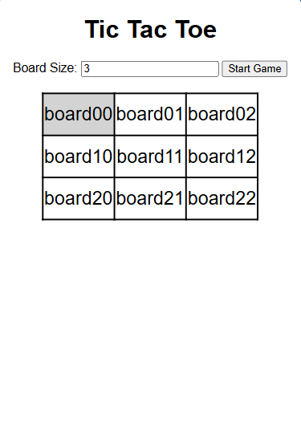

# Tic Tac Toe using Springboot
This is a configurable Tic Tac Toe game built using Java Spring Boot as the backend and HTML + JavaScript as the frontend. It allows players to play Tic Tac Toe on any board size (e.g., 3x3, 5x5, 9x9) and follows best practices in OOP (Object-Oriented Programming).

---
## Technologies Used

1. **Backend**: Java, Spring Boot (REST API)
2. **Frontend**: HTML, JavaScript
3. **Build Tool**: Maven
4. **Logging**: SLF4J

---
## Additional features that can be improve

**Improvements & Future Enhancements**
1. Improve UI with React.js or Vue.js.
2. Store game data in a database (MySQL / Postgres). 
3. Add AI to play against the computer. (Optional)

---
## Additional notes
1. User service can implement service to save player to database (If want to make it advance user need to create account and implement JWT or OAuth2)
2. Logging can be updated to Json format (Optional for datadog)
3. Better UI / Front end using React
4. If developer don't want to use database can be use `Map` to store in memory
5. For now, I'm using axios in the frontend for the Html so it can consume api, can be improve using better framework
6. Have a features to create and delete user (Can be improve)
7. The structure it self is one to many (One user can have many games) and many to one on the Game (Many games can be had by one user)
8. The application as for now might not work to run on local (As for now to play using api (Postman))
9. I have implement the swagger config for the API Documentation however can be improved for further needs

---
# Running the application
Since it's using the H2 database so it will created automatically sets on the `application.properties` under `C:/Users/<Username>` you can update the settings under the `spring.datasource.url` and change the `<Username>` into your path name as for now the H2 database will re-create everytime the application start

1. Run the Application
2. Create user using postman hit
     `localhost:8080/api/transaction/create`
      with request body
    {
    "name" : "tes",
    "status" : "new"
    }

3. Access H2 Database (Open in console browser `http://localhost:8080/h2-console`)
    JDBC URL:
    **Username**: sa
    **Password**: (leave blank)
    Click Connect, then run:
4. Open your browser:
    http://localhost:8080/index.html
5. Play

**The game might not working need to be checked for the further details**
**Need to check logic for integration from Backend to FE**

## As for now the logic for create board is still hardcode, need more improvement

 For Api documentation using swagger can be access through http://localhost:8080/swagger-ui/index.html#/